## Setting up Django Backend
**Notice**: Commands used in this tutorial are executed under Linux Mint and are not tested under Windows and MAC OS

Open a new terminal window and run the following command to create a new project directory:
```sh
mkdir api-django
```
Navigate inside the directory
```sh
cd api-django
```
Good practice is for each new project to using isolated virtual environment lik "venv".
**venv** is the standard tool for creating virtual environments, and has been part of Python since Python 3.3

Generate new venv with command:
```sh
python3 -m venv .venv
```
Now we need to activate venv:
```sh
source .venv/bin/activate

# on success prompt will look like this:
(venv)$: 
```
Now is time to install needed python packages with pip3
```sh
pip3 install django
```


Django have handy command that will generate new project for us:
```
django-admin startproject backend
```

This directory is root for our Project. Each Django project cant hav multiple application inside this directory.

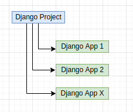

navigate into the newly created backend dir
```sh
cd backend
```

Start a new application called todo(inside venv it doesn't mether if commands are with  python or python3):
```sh
python manage.py startapp todo
or
python3 manage.py startapp todo
```
now we have dir for our first Application:
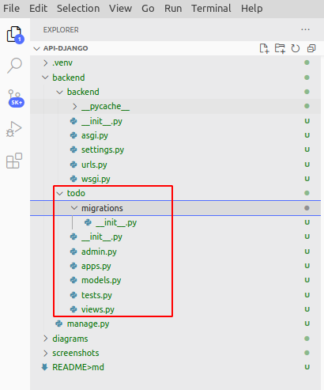

Django have another handy command that will generate new Database for us:
```sh
python manage.py migrate
```
In terminal we will see:
```sh
python manage.py migrate
Operations to perform:
  Apply all migrations: admin, auth, contenttypes, sessions
Running migrations:
  Applying contenttypes.0001_initial... OK
  Applying auth.0001_initial... OK
  Applying admin.0001_initial... OK
  Applying admin.0002_logentry_remove_auto_add... OK
  Applying admin.0003_logentry_add_action_flag_choices... OK
  Applying contenttypes.0002_remove_content_type_name... OK
  Applying auth.0002_alter_permission_name_max_length... OK
  Applying auth.0003_alter_user_email_max_length... OK
  Applying auth.0004_alter_user_username_opts... OK
  Applying auth.0005_alter_user_last_login_null... OK
  Applying auth.0006_require_contenttypes_0002... OK
  Applying auth.0007_alter_validators_add_error_messages... OK
  Applying auth.0008_alter_user_username_max_length... OK
  Applying auth.0009_alter_user_last_name_max_length... OK
  Applying auth.0010_alter_group_name_max_length... OK
  Applying auth.0011_update_proxy_permissions... OK
  Applying auth.0012_alter_user_first_name_max_length... OK
  Applying sessions.0001_initial... OK
```
This command will create file "db.sqlite3" this is out database

Now is time to run and see our new backend website:
```sh
python manage.py runserver
```
Output in terminal will be:
```sh
python manage.py runserver
Watching for file changes with StatReloader
Performing system checks...

System check identified no issues (0 silenced).
May 28, 2022 - 19:10:43
Django version 4.0.4, using settings 'backend.settings'
Starting development server at http://127.0.0.1:8000/
Quit the server with CONTROL-C.
```
click over URL:[http://127.0.0.1:8000/](http://127.0.0.1:8000/)  or just open it in browser

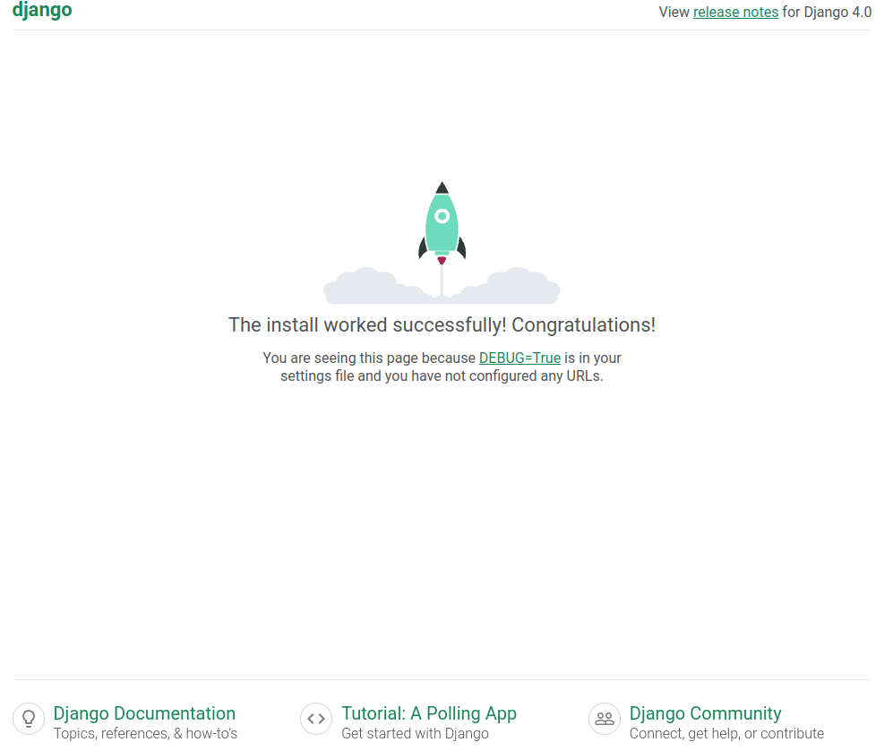

If all is OK you can stop the server with keys combination CTRL+C.

Because it's god practice each project to be track witt git version control we need to create new file with name ".gitignore" in our root directory "api-django":

```sh
# Environments 
.venv 

# Django #
*.log
*.pot
*.pyc
__pycache__
```
This will reduce cont of file in our github repo and will make our project more reusable.
Notice files and folders with grey color, this mean that they are not included anymore in git version control.
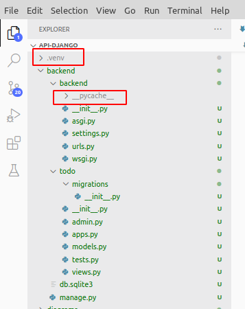


### Adding TODO application in our project

Now is time to continue work over our fist Django application
Open file "backend/settings.py" and find section "Application definition" and add new finale line like this

```py
INSTALLED_APPS = [
    'django.contrib.admin',
    'django.contrib.auth',
    'django.contrib.contenttypes',
    'django.contrib.sessions',
    'django.contrib.messages',
    'django.contrib.staticfiles',
    'todo' # our first Django Application
]
```
Save change to file.

### Creating Model
A model is the single, definitive source of information about your data. It contains the essential fields and behaviors of the data you’re storing. Generally, each model maps to a single database table. source: [docs.djangoproject.com](https://docs.djangoproject.com/en/4.0/topics/db/models/)

Open and edit file: backend/todo/models.py
```py
from pickle import FALSE
from django.db import models

class Todo(models.Model):
    # we can write max 200 characters in Title field
    title = models.CharField(max_length = 200)
    description = models.TextField()
    # by default all new created task will be uncompleted
    completed = models.BooleanField(default = False)

    def __str__(self):
        return self.title
```
Now is time to ask Django to create some changes for us in database. We using migrations for for this purpose.
Migrations are Django’s way of propagating changes you make to your models (adding a field, deleting a model, etc.) into your database schema. They’re designed to be mostly automatic, but you’ll need to know when to make migrations, when to run them, and the common problems you might run into.source: [docs.djangoproject.com](https://docs.djangoproject.com/en/4.0/topics/migrations/)

Command makemigrations which is responsible for creating new migrations based on the changes you have made to your models.
```py
python manage.py makemigrations todo
```
terminal output should be like:
```sh
Migrations for 'todo':
  todo/migrations/0001_initial.py
    - Create model Todo
```
this command will generate for us file: backend/todo/migrations/0001_initial.py

Now with next command we will apply all new changes in database or **migrate** is responsible for applying and unapplying migrations.:
```py
python manage.py migrate todo
```
terminal output:
```sh
Operations to perform:
  Apply all migrations: todo
Running migrations:
  Applying todo.0001_initial... OK
```

To work our TODO app we need to use some type of user interface and now is time to create it.
Django have build in Admin tool and dashboard for this type of operations.

Open and edit file: backend/todo/admin.py like this:
```py
from django.contrib import admin
from .models import Todo # Django now cant import our Model file

class TodoAdmin(admin.ModelAdmin):
    #  what fields will be visible in our Admin dashboard
    list_display = ('title', 'description', 'completed')

# Register your models here.
admin.site.register(Todo, TodoAdmin)
```

### Creating Administrator user and password
```sh
python manage.py createsuperuser
```
You will be prompted to enter a username, email, and password for the superuser. Please re,e,ber username and password.
In our test case we will use: 'admin' and 'asdf'. **Notice:** never use short password in production websites.

Terminal output:
```sh
Username (leave blank to use 'ivanov'): admin
Email address: 
Password: 
Password (again): 
This password is too short. It must contain at least 8 characters.
This password is too common.
Bypass password validation and create user anyway? [y/N]: y
Superuser created successfully.
```
Now is time to run local webserver and see what we have done.
```sh
python manage.py runserver
```
Open in browser [http://localhost:8000/admin](http://localhost:8000/admin)

Log in with the username and password that we create before that

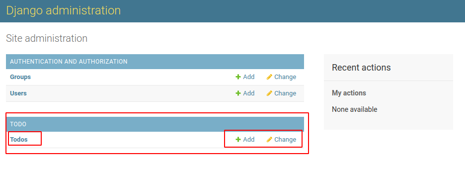

Now is time to add some test task to see if website work.
Add some task for test.
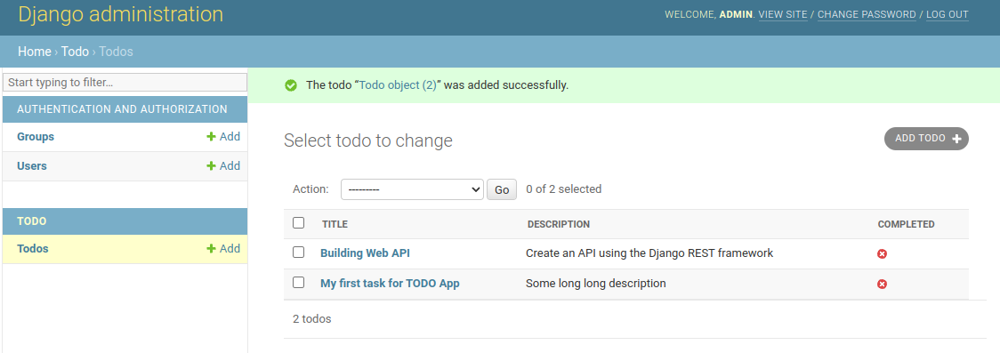


### Creating API using Django REST Framework
In this example we will use [django-rest-framework.org](https://www.django-rest-framework.org/) and [django-cors-headers](https://pypi.org/project/django-cors-headers/). 
django-cors-headers  adds Cross-Origin Resource Sharing (CORS) headers to responses. This allows in-browser requests to your Django application from other origins in our case from localhost

If server is still running you must stop is with keys combination CRL + C and then install new required packages:
```sh
pip3 install djangorestframework django-cors-headers
```

Open and edit file: backend/settings.py
```py
INSTALLED_APPS = [
    'django.contrib.admin',
    'django.contrib.auth',
    'django.contrib.contenttypes',
    'django.contrib.sessions',
    'django.contrib.messages',
    'django.contrib.staticfiles',
    'todo', # our first Django Application
    'corsheaders',
    'rest_framework',
]

MIDDLEWARE = [
    'django.middleware.security.SecurityMiddleware',
    'django.contrib.sessions.middleware.SessionMiddleware',
    'django.middleware.common.CommonMiddleware',
    'django.middleware.csrf.CsrfViewMiddleware',
    'django.contrib.auth.middleware.AuthenticationMiddleware',
    'django.contrib.messages.middleware.MessageMiddleware',
    'django.middleware.clickjacking.XFrameOptionsMiddleware',
    'corsheaders.middleware.CorsMiddleware',
]
```
Then add this lines to the bottom of the backend/settings.py file:
```py
CORS_ORIGIN_WHITELIST = [
    'http://localhost:3000'
]
```

### Convert model instances to JSON - creating serializers

Serializers will send JSON data to any frontend. In todo folder create new file with name serializers.py.
Path must be like this: backend/todo/serializers.py
```py
# backend/todo/serializers.py
from rest_framework import serializers
from .models import Todo

class TodoSerializer(serializers.ModelSerializer):
    class Meta:
        model = Todo
        # fields contained and converted in JSON data
        fields = ('id', 'title', 'description', 'completed')
```

To be more easy our development we need to create View. Open file todo/views.py:
```py
from django.shortcuts import render
# base class provides the implementation for CRUD operations by default
from rest_framework import viewsets
from .serializers import TodoSerializer
from .models import Todo

class TodoView(viewsets.ModelViewSet):
    serializer_class = TodoSerializer
    queryset = Todo.objects.all()
```

### API URLs
Final step is to define URL paths for our API. Open file backend/urls.py:
```py
# backend/urls.py
from django.contrib import admin
from django.urls import path, include
from rest_framework import routers
from todo import views


router = routers.DefaultRouter()
router.register(r'todos', views.TodoView, 'todo')


urlpatterns = [
    path('admin/', admin.site.urls),
    path('api/v1/', include(router.urls)),
]
```

run server: 
```py
python manage.py runserver
```
Open browser and visit:
[http://127.0.0.1:8000/api/v1/todos/](http://127.0.0.1:8000/api/v1/todos/) - list all TODO tasks
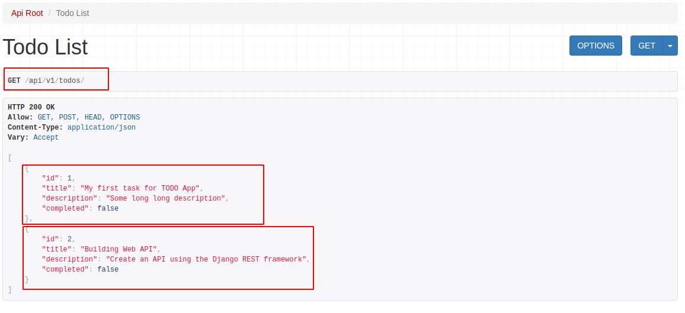


[http://127.0.0.1:8000/api/v1/todos/1](http://127.0.0.1:8000/api/v1/todos/1)- show only TODO with ID 1


### visual browser for SQLite DB
[](https://sqlitebrowser.org/) is visual tool that will help you to understand how information is stored in SQLite 3 DB.
Download and run program. Open file db.sqlite3 located in our project.
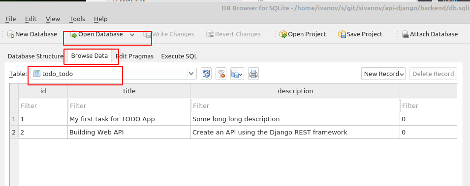

Alternative variant will be if you use VSC editor and need to download extension: [https://marketplace.visualstudio.com/items?itemName=qwtel.sqlite-viewer](https://marketplace.visualstudio.com/items?itemName=qwtel.sqlite-viewer)


### Adding Category field in TODO app
Open and edit file: 
```py
# Notice this Class must be placed before class Todo
# Category table that inherits model.Models
class Category(models.Model):
    name = models.CharField(max_length=100)

    class Meta:
        verbose_name = ("Category")
        verbose_name_plural = ("Categories")

    def __str__(self):
        return self.name # name to be shown when called


class Todo(models.Model):
.....
```
Notice: It is important to create from Admin Dashboard first default category and after that to connect model Category with model Todo

creating new migrations based on the changes you have made to your models
```
python manage.py makemigrations
```
Terminal output:
```sh
Migrations for 'todo':
  todo/migrations/0002_category.py
    - Create model Category
```

To apply changes in Database
```
python manage.py migrate
```
terminal output:
```sh
Operations to perform:
  Apply all migrations: admin, auth, contenttypes, sessions, todo
Running migrations:
  Applying todo.0002_category... OK
```
Ok, now we need to add new model to be visible in Admin Dashboard.
open file: backend/todo/admin.py  to look like this:
```py
from django.contrib import admin
from .models import Category, Todo # Django now cant import our Model file

class TodoAdmin(admin.ModelAdmin):
    #  what fields will be visible in our Admin dashboard
    list_display = ('title', 'description', 'completed')

class CategoryAdmin(admin.ModelAdmin):
    list_display = ('name',)

# Register your models here.
admin.site.register(Todo, TodoAdmin)
admin.site.register(Category, CategoryAdmin)
```

start server 
```sh
python manage.py  runserver
```

Open in browser [http://localhost:8000/admin](http://localhost:8000/admin)
Now you can see new section with name 'Category'. Add  new category with name 'Default'
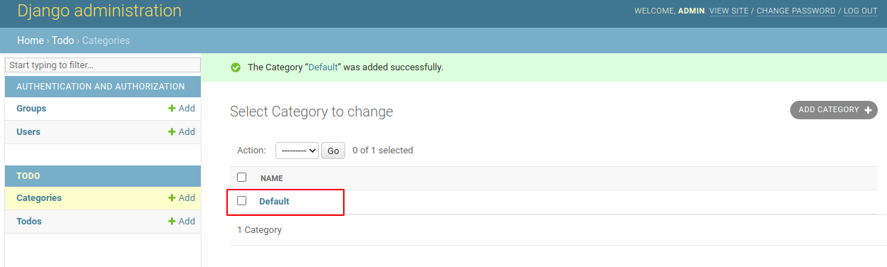

Now stop server with Ctr + C. Open and edit file: backend/todo/models.py
```py
class Todo(models.Model):
    # we can write max 200 characters in Title field
    title = models.CharField(max_length = 200)
    description = models.TextField()
    # by default all new created task will be uncompleted
    completed = models.BooleanField(default = False)
    # Foreignkey
    category = models.ForeignKey(Category, on_delete=models.PROTECT, default = 1)
```
With on_delete=models.PROTECT we tell to Django is by some reason some category is deleted, to protect our task and to assign to him default value with id 1.It is good practice to not change this Default category name.

Now it is time to update our migration with command:
```
python manage.py makemigrations
```
result:
```sh
Migrations for 'todo':
  todo/migrations/0003_todo_category.py
    - Add field category to todo
```

and to apply changes in DB
```
python manage.py migrate
```
result:
```sh
Operations to perform:
  Apply all migrations: admin, auth, contenttypes, sessions, todo
Running migrations:
  Applying todo.0003_todo_category... OK
```
Start again webserver:
```
python manage.py  runserver
```
Open in browser [http://localhost:8000/admin](http://localhost:8000/admin)
and if you open some of task they will have populated default category now.
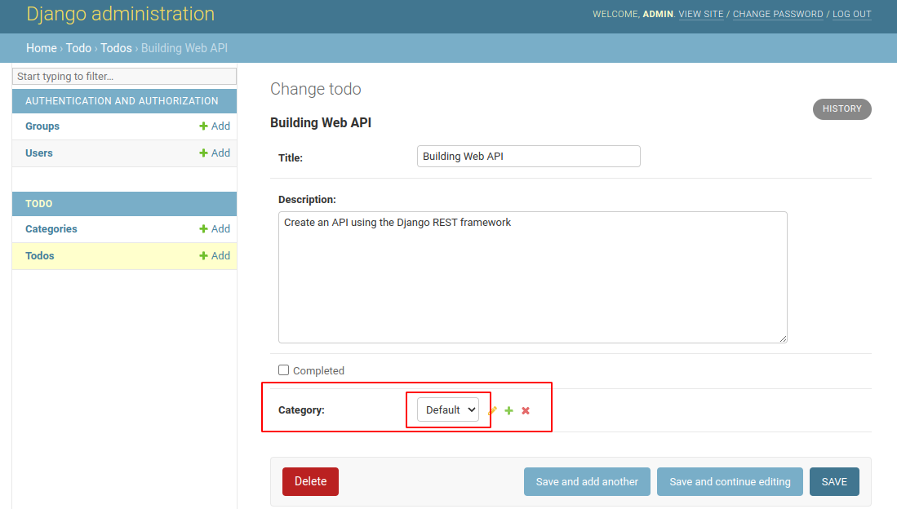

Feel fre to add new catagories and to update existing task with them.

### Exposing new field Category in API JSON Data
Open and edit file: backend/todo/serializers.py and add ```'category',```
```py
fields = ('id', 'title', 'category', 'description', 'completed')
```
If you open browser on [http://127.0.0.1:8000/api/v1/todos/](http://127.0.0.1:8000/api/v1/todos/) filed must exist in JSOn Data
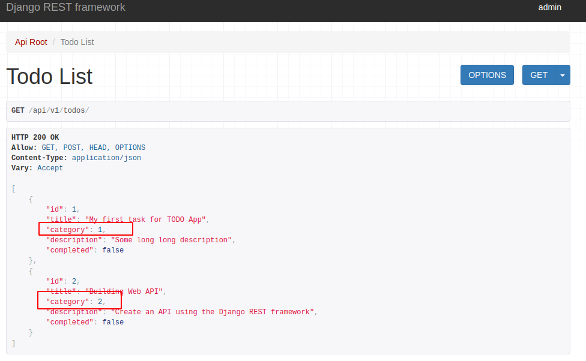


### Show category name instead of Database ID
Open and edit file and 2 rows one with comment and this after him: 
```py
class TodoSerializer(serializers.ModelSerializer):
    # replace category ID in Database with actual human readable name
    category = serializers.CharField(source="category.name", read_only=True)
```

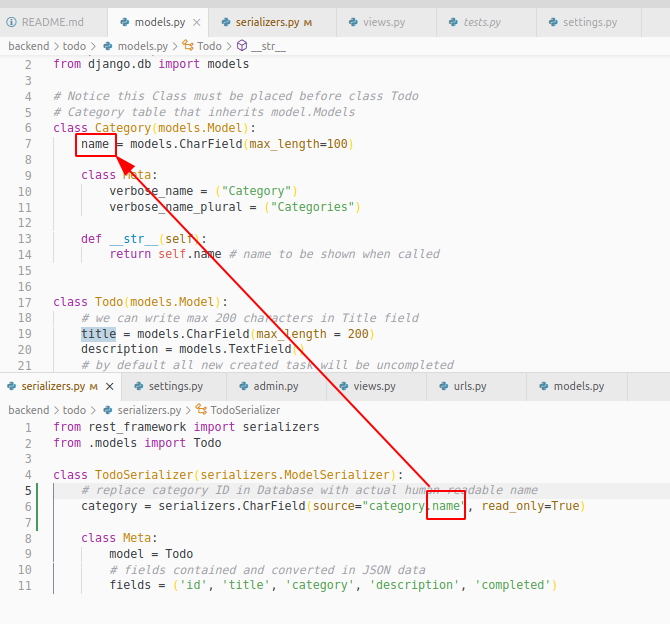


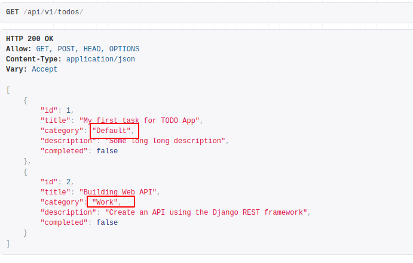


### Add priority field
For simplicity range for priority will be from intigers from 1 to 10 scale. By this way you no need to remember words related with prioriry level and query to DB will be more simple for now.
Open and edit file: backend/todo/models.py
```py
class Todo(models.Model):
    PRIORITY_LEVELS = (
        ('1', '1'),
        ('2', '2'),
        ('3', '3'),
        ('4', '4'),
        ('5', '5'),
        ('6', '6'),
        ('7', '7'),
        ('8', '8'),
        ('9', '9'),
        ('10', '10'),
    )
```


```
python manage.py makemigrations
```
Output:
```sh
Migrations for 'todo':
  todo/migrations/0004_todo_priority.py
    - Add field priority to todo
```

```
python manage.py migrate
```
output:
```sh
Operations to perform:
  Apply all migrations: admin, auth, contenttypes, sessions, todo
Running migrations:
  Applying todo.0004_todo_priority... OK
```

Is webserver is not running start it with:
```
python manage.py  runserver
```
open Admin dashboard: [http://127.0.0.1:8000/admin/todo/todo/1/change/](http://127.0.0.1:8000/admin/todo/todo/1/change/)

If you check all existing task they will be filled with default value "1"
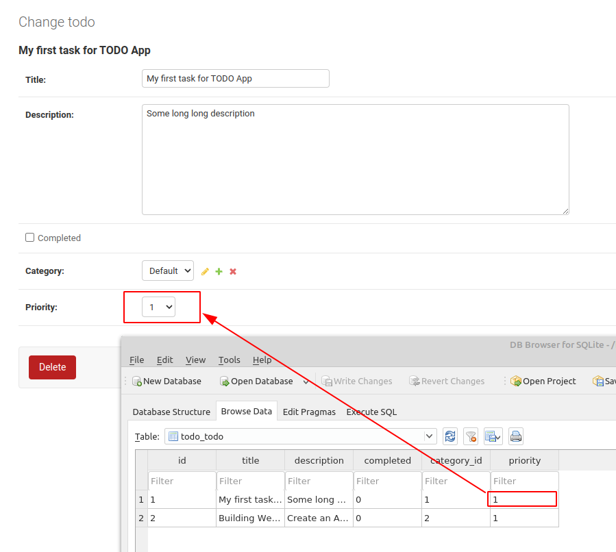

Now is time this filed to be visible in API JSON data and Djnago buy default dont show new fields unless you explicitly do so.


### Statistics for site-packages count and size

.venv/share/python-wheels             27 items, totalling  2,2 MB<br>
.venv/lib/python3.8/site-packages: 7 637 items, totalling 41,8 MB

After installing django-rest-framework and django-cors-headers:

.venv/lib/python3.8/site-packages: 8 775 items, totalling 46,7 MB